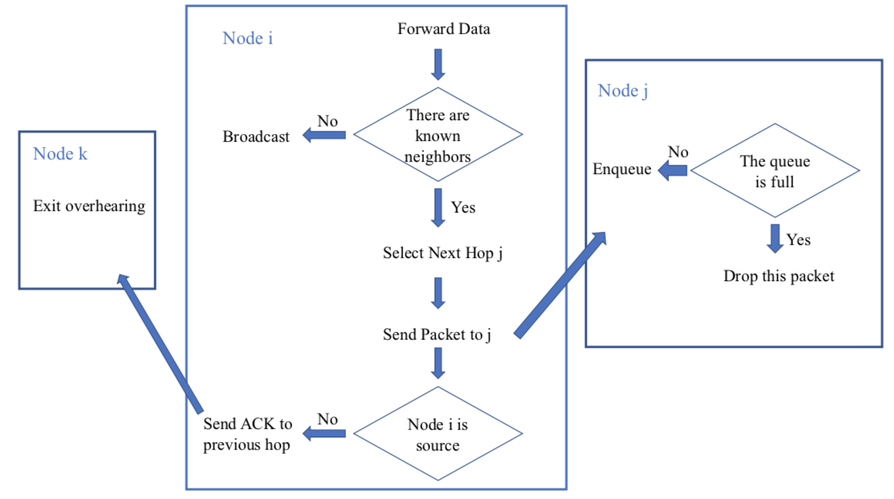

# SJTU-CS339-Project: HyDRO Reimplementation
This project is finished by Chen Wang, Yanjun Fu, Ke Li and Yongqing Xu. The C++ code is finished by Chen Wang and Yanjun Fu, the NS2 simulation is finished by Ke Li, the PPT is finished by Yongqing Xu, and the report is finished by Chen Wang, Yanjun Fu and Yongqing Xu.

**HyDRO**, which is the short of **H**arvesting-aware **D**ata **RO**uting, is proposed by Basagni et al. Our project is to reimplement this paper ''*Harnessing HyDRO: Harvesting-aware Data ROuting for Underwater Wireless Sensor Networks, MobiHoc 2018* ''. Since the simulator SUNSET mentioned in this paper is not available and more detailed parameters' settings are not available, our reimplementation makes some reasonable simplifications.

## Reinforcement Learning Based Routing

The routing algorithm utilizes the traditional reinforcement learning algorithm: **Q-Learning**. The algorithm chooses relays, taking both residual energy and fore- seeable harvestable energy into account.

## Multi-thread Programming
Our program is using multi-thread techniques.

## Implicit ACK
The pipeline is shown below.

    

## Simulation Parameters
| **Parameter** | **Value** |
| ------- | :-----: |
| Simulation duration | 20min |
| Number of nodes | 20 |
| Size of deployment area | 2km^2 |
| Depth of deployment | 10m~240m |
| Bit rate | 4000b/s |
| Packet payload size | 1000B |
| Packet header size | 15B |
| Packet inter-arrival time | \[5,4,3\](low to high traffic) |
| Number of retransmissions K | \[5,4,3\](low to high) |
| Discount factor \gamma | 0.95 |
